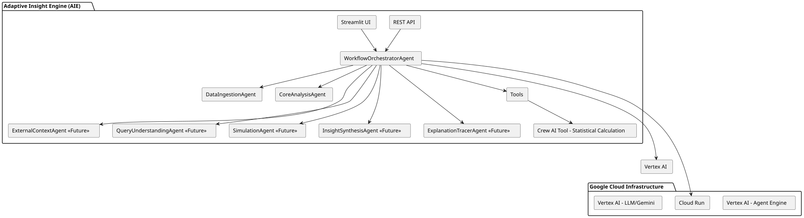

# Adaptive Insight Engine (AIE)

AIE is a modular, extensible GenAI multi-agent system built with Google Cloud's Agent Development Kit (ADK), Streamlit, and best-in-class Python libraries. It is designed for rapid prototyping, enterprise-grade deployment, and seamless integration with Google Cloud services (Vertex AI, Agent Engine, Cloud Run, and more).

## Overview
This project demonstrates a multi-agent system for advanced data analysis and insight generation. AIE integrates specialized agents for data ingestion, context enrichment, analysis, simulation, and narrative synthesis. It supports both interactive (Streamlit) and programmatic (REST API) interfaces, and is cloud-native for easy deployment on Google Cloud or locally.

---

## Architecture & Agent Details

**Multi-Agent Architecture**
- Top-level orchestrator agent delegates tasks to specialized sub-agents.
- Each agent is a modular Python class with a clear responsibility.

**Agent Roles:**
- **WorkflowOrchestratorAgent**: Manages the sequence of analysis tasks based on user selections.
- **DataIngestionAgent**: Handles data intake, cleaning, and storage (CSV, PDF, TEXT).
- **CoreAnalysisAgent**: Performs core data analysis and correlation.

*The following agents are part of the future roadmap:*
- **ExternalContextAgent** (Future Plan): Will fetch and merge external public data (APIs, public datasets).
- **QueryUnderstandingAgent** (Future Plan): Will interpret user follow-up queries using GenAI (Gemini/Vertex AI).
- **SimulationAgent** (Future Plan): Will run 'what-if' scenario simulations.
- **InsightSynthesisAgent** (Future Plan): Will synthesize insights and generate narratives using GenAI.
- **ExplanationTracerAgent** (Future Plan): Will collect logs and provide traceable explanations for all insights.

---

## Key Features
- **Multi-Agent Orchestration**: Modular, extensible agents for each pipeline stage.
- **Streamlit Web UI**: Interactive file upload, parameter selection, and results.
- **REST API**: FastAPI endpoints for programmatic access.
- **Cloud Native**: Deployable locally, on Cloud Run, or Vertex AI.
- **Structured Logging**: All actions and data flows are logged for monitoring and evaluation.
- **Supports CSV, PDF, TEXT**: Flexible data ingestion.
- **Crew AI Tool for Statistical Analysis**: Leverages Crew AI for robust, accurate, and explainable statistical calculations within the CoreAnalysisAgent, ensuring high-quality and auditable results.
- **Extensible Protocols**: Stubs for MCP and A2A for future multi-agent interoperability.
- **Best-in-Class Libraries**: pandas, numpy, scikit-learn, statsmodels, google-cloud-*, structlog, etc.
- **Deployment Ready**: Dockerized, with scripts for local and cloud deployment.

---

## Architecture Diagram



*Figure: High-level architecture showing the interaction between components and services.*

---

## Directory Structure

```
adaptive_insight_engine/
│
├── adaptive_insight_engine/
│   ├── workflow_orchestrator/
│   │   └── sub_agents/
│   │       ├── core_analysis/
│   │       ├── data_ingestion/
│   │       ├── explanation_tracer/        # (Future Plan)
│   │       ├── external_context/           # (Future Plan)
│   │       ├── insight_synthesis/          # (Future Plan)
│   │       ├── query_understanding/        # (Future Plan)
│   │       └── simulation/                 # (Future Plan)
│   └── ... (other agent logic)
├── tools/                     # Data processing, analysis, simulation tools
├── interfaces/                # Web, REST, MCP, A2A protocol handlers
├── utils/                     # Shared utilities (logging, config, etc.)
├── deployment/                # Docker, cloud deployment scripts
├── tests/                     # Unit and integration tests
├── README.md
├── pyproject.toml
└── .env-example
```

---

## Setup and Installation

### Prerequisites
- Python 3.10+
- [Poetry](https://python-poetry.org/docs/) (recommended) or pip
- Google Cloud account (for Vertex AI/Cloud Run deployment)
- [Git](https://git-scm.com/)

### Project Setup
1. **Clone the repository:**
   ```sh
   git clone <your-repo-url>
   cd adaptive_insight_engine
   ```
2. **Install dependencies:**
   - With Poetry:
     ```sh
     poetry install
     ```
   - Or with pip:
     ```sh
     pip install -r requirements.txt
     ```
3. **Set up environment variables:**
   - Copy `.env-example` to `.env` and fill in your credentials.

---

## Running the Agent

### Streamlit Web App
```sh
poetry run run-streamlit
# or
streamlit run interfaces/streamlit_app.py
```

### REST API
```sh
poetry run run-api
# or
uvicorn interfaces.rest_api:app --reload
```

### Cloud Deployment
See `deployment/` for Docker, Cloud Run, and Vertex AI scripts and instructions.

---

## Example Agent Interaction

**User:** Hi, I want to analyze this sales data CSV.

**Agent:** Please upload your file. What analysis would you like to perform?

**User:** Show me a summary and trends by region.

**Agent:** [Returns summary statistics and a plot of sales trends by region.]

**User:** Can you run a 'what-if' scenario for increased sales in Q3?

**Agent:** [Runs simulation and returns projected results.]

**User:** Generate a narrative insight for the executive team.

**Agent:** [Returns a concise, GenAI-generated narrative.]

---

## Testing and Evaluation

### Run All Tests
```sh
poetry run pytest tests
```
- Integration, sub-agent, and environment query tests are included.

### Run Evaluation Tests
```sh
poetry run pytest eval
```
- Evaluates overall agent performance and capabilities.

---

## Extensibility & Customization

- **Add new agents:** Create a new class in `adaptive_insight_engine/` and register it in the orchestrator.
- **Add new tools:** Implement in `tools/` and expose to agents as needed.
- **Integrate new data sources:** Extend `DataIngestionAgent` and `ExternalContextAgent`.
- **Support new protocols:** Implement handlers in `interfaces/`.

---

## References
- [Vertex AI multi-agent systems overview](https://cloud.google.com/blog/products/ai-machine-learning/build-and-manage-multi-system-agents-with-vertex-ai)
- [Agent Development Kit (ADK)](https://developers.googleblog.com/en/agent-development-kit-easy-to-build-multi-agent-applications/)

---

## License

MIT

## Getting Started

1. **Clone the repo**
2. **Install dependencies**: If using Poetry, run `poetry install`. If using pip, run `pip install -r requirements.txt`.
3. **Set up environment variables**: Copy `.env-example` to `.env` and fill in your credentials.
4. **Run locally**:
   - Streamlit UI: `streamlit run interfaces/streamlit_app.py` or `poetry run run-streamlit`
   - REST API: `uvicorn interfaces.rest_api:app --reload` or `poetry run run-api`
5. **Deploy to Cloud Run/Vertex AI**: See `deployment/` for scripts and instructions.

---

## Extensibility & Customization

- **Add new agents**: Create a new class in `adaptive_insight_engine/` and register it in the orchestrator.
- **Add new tools**: Implement in `tools/` and expose to agents as needed.
- **Integrate new data sources**: Extend `DataIngestionAgent` and `ExternalContextAgent`.
- **Support new protocols**: Implement handlers in `interfaces/`.

---

## References

- [Vertex AI multi-agent systems overview](https://cloud.google.com/blog/products/ai-machine-learning/build-and-manage-multi-system-agents-with-vertex-ai)
- [Agent Development Kit (ADK)](https://developers.googleblog.com/en/agent-development-kit-easy-to-build-multi-agent-applications/)

---

## License

MIT
